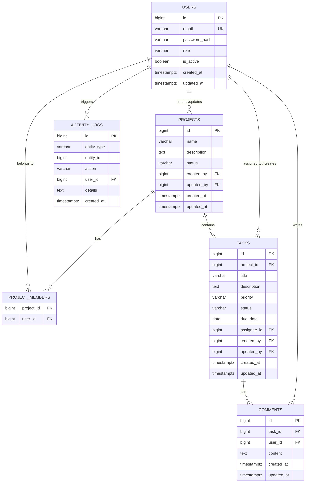

# Team Task Tracker (Full Stack)

A comprehensive, full-stack application for managing projects, tasks, comments, and team members. It features robust role-based access control (RBAC), activity logging on the backend, and a modern, responsive Glassmorphism UI on the frontend.

---

## Features

### Frontend (React + Vite)
- **Modern UI/UX**: Built with React and Vite, featuring a sleek, dark-mode Glassmorphism design system.
- **Custom Notifications**: A custom `ToastContext` provides non-blocking, smooth slide-in notifications and blurred confirmation modals, eliminating jarring default browser alerts.
- **Dynamic Dashboards**: Real-time project boards, drag-and-drop task emulation, and role-specific views.

### Backend (Spring Boot 3 + PostgreSQL)
- **RESTful API**: Fully documented API with JWT-based stateless authentication.
- **Strict Validations**: Enforces OWASP-standard email validation, password constraints, and input sanitization.
- **Role-Based Access Control**:
  - `ADMINISTRATOR`: Full access to all resources and user role management.
  - `PROJECT_MANAGER`: Can create/update projects, manage members, and oversee all tasks.
  - `MEMBER`: Can only view assigned projects and update tasks explicitly assigned to them.
- **Activity Logging**: All major business events (project creation, task updates, comments) are audited in an `activity_logs` table using isolated database transactions.

---

## How to Run

### Option A: Run Full Stack via Docker (Production / Quickstart)

The easiest way to run the entire application (Database, Backend, and Frontend).

**Prerequisites**: Docker & Docker Compose

```bash
docker-compose up -d --build
```
This spins up the following services:
- **PostgreSQL Database** on `localhost:5432`
- **pgAdmin** on `http://localhost:5050` (login: `admin@tracker.com` / `admin`)
- **Spring Boot Backend** on `http://localhost:8080` (Auto-runs Flyway schema migrations)
- **React Frontend** (via Nginx) on `http://localhost:80` (or `localhost:5173` depending on port mappings)

### Option B: Local Development Setup

If you wish to run the backend and frontend separately.

**Prerequisites**:
- Java 21 & Maven 3.8+
- Node.js 18+ & npm
- Docker (just for the database)

**1. Start the Database**
```bash
docker-compose up -d postgres pgadmin
```

**2. Start the Spring Boot Backend**
```bash
./mvnw clean package -DskipTests
./mvnw spring-boot:run
```
*(Runs on `http://localhost:8080`. Swagger UI is available at `/swagger-ui.html`)*

**3. Start the React Frontend**
```bash
cd frontend
npm install
npm run dev
```
*(Runs on `http://localhost:5173`)*

---

### Sample Test Credentials
These are seeded automatically by Flyway on startup:

| Email | Password | Role |
|---|---|---|
| `admin@tracker.com` | `Admin@1234` | ADMINISTRATOR |
| `pm@tracker.com` | `Manager@1234` | PROJECT_MANAGER |
| `alice@tracker.com` | `Member@1234` | MEMBER |
| `bob@tracker.com` | `Member@1234` | MEMBER |

---

## Entity Relationship Diagram (ERD)



---

## Business Rules

### Project Rules
1. Only `ADMINISTRATOR` and `PROJECT_MANAGER` can create or update projects.
2. Project status can be `ACTIVE` or `ARCHIVED`.
3. The creator of a project is automatically added as a member.
4. The creator cannot be removed from a project (business invariant).
5. Only project members can create tasks or comments within that project.
6. All project updates track `updated_by` and `updated_at`.
7. `MEMBER` users can only view projects they are explicitly assigned to. `ADMINISTRATOR` and `PROJECT_MANAGER` can view all projects.

### User & Security Rules
1. Self-registration automatically assigns the `MEMBER` role to prevent privilege escalation.
2. Only `ADMINISTRATOR`s can change the roles of other users (to `PROJECT_MANAGER` or `ADMINISTRATOR`).
3. Strict Regex validation is applied to all Email inputs (`^[a-zA-Z0-9_+&*-]+(?:\.[a-zA-Z0-9_+&*-]+)*@(?:[a-zA-Z0-9-]+\.)+[a-zA-Z]{2,7}$`).

### Task Status State Machine
Valid transitions only:

```
TODO ──────────────────► IN_PROGRESS ──► DONE ──► REOPENED
  │                           │                       │
  └──────────────────────► CANCELLED ◄────────────────┘
```

| From | Allowed Transitions |
|---|---|
| `TODO` | `IN_PROGRESS`, `CANCELLED` |
| `IN_PROGRESS` | `DONE`, `TODO`, `CANCELLED` |
| `DONE` | `REOPENED` |
| `REOPENED` | `IN_PROGRESS`, `CANCELLED` |
| `CANCELLED` | `REOPENED` |

Any other transition returns `409 Conflict`.

### Task Assignment Rules
1. Assignee must be a member of the project — enforced on create and update.
2. `MEMBER` role users can only update or change the status of tasks assigned **to themselves**.
3. `ADMINISTRATOR` and `PROJECT_MANAGER` can update any task regardless of assignment.
4. Reassignment is logged separately in the activity log.

---

## Main Design Choices

| Decision | Rationale |
|---|---|
| **JWT (stateless)** | No server-side session storage — scales horizontally and simplifies deployment |
| **Enums for status/role** | Compile-time safety, prevents invalid values reaching the DB, stored as `VARCHAR` for readability |
| **Sub-resource endpoints for members** | `POST /projects/{id}/members/{userId}` avoids race conditions from concurrent project updates and is easily extensible |
| **Single source of truth for access control** | Path-level rules in `SecurityConfig`; fine-grained data checks in the service layer via `SecurityContextHolder`. Zero duplication. |
| **`@AuthenticationPrincipal` in controllers** | The authenticated user's email comes from the JWT, never from the request body — prevents privilege escalation |
| **Flyway migrations** | Versioned, reproducible schema changes; `V1` creates schema, `V2` seeds test data |

---

## Assumptions

1. Authentication is email + password.
2. Deleted users set FK references to `NULL` (preserved for audit history).
3. A user can belong to multiple projects simultaneously.
4. Password complexity: minimum 8 characters validated at the API layer.
