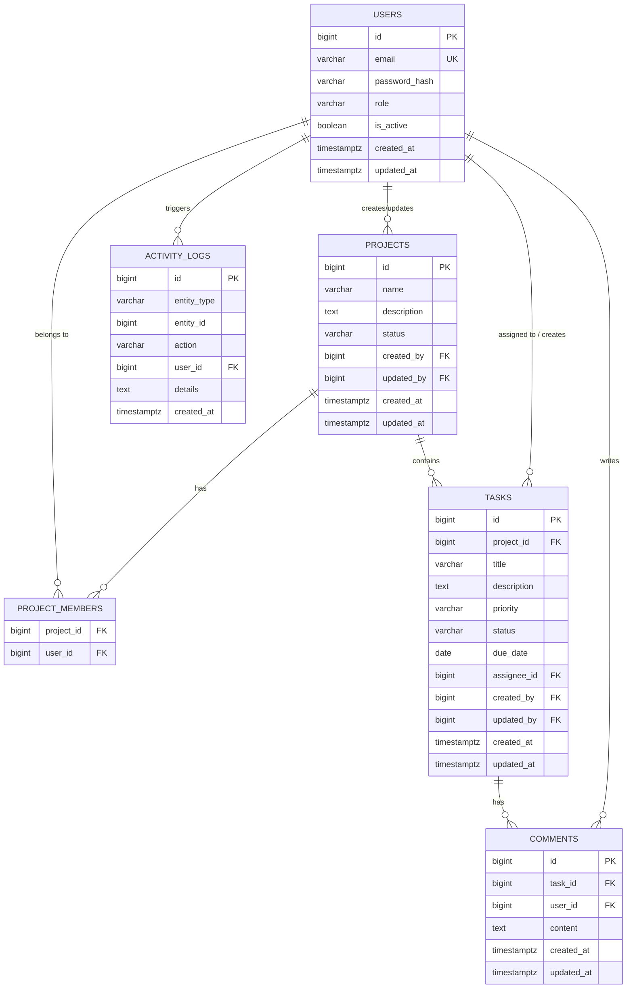

# Team Task Tracker API

A RESTful backend for managing projects, tasks, comments, and team members with role-based access control and activity logging.

---

## How to Run

### Prerequisites
- Java 21
- Maven 3.8+
- Docker & Docker Compose

### 1. Start the Database

```bash
docker-compose up -d
```

This starts:
- **PostgreSQL** on `localhost:5432` (DB: `tasktracker`, user: `postgres`, password: `123456`)
- **pgAdmin** on `http://localhost:5050` (login: `admin@tracker.com` / `admin`)

### 2. Build & Run the Application

```bash
./mvnw clean package -DskipTests
./mvnw spring-boot:run
```

Flyway will automatically apply schema and sample data migrations on startup.

### 3. Swagger UI

Open `http://localhost:8080/swagger-ui.html`

Use the **Authorize** button to paste a JWT token after logging in via `POST /api/users/login`.

### Sample Test Credentials

| Email | Password | Role |
|---|---|---|
| `admin@tracker.com` | `Admin@1234` | ADMINISTRATOR |
| `pm@tracker.com` | `Manager@1234` | PROJECT_MANAGER |
| `alice@tracker.com` | `Member@1234` | MEMBER |
| `bob@tracker.com` | `Member@1234` | MEMBER |

---

## Entity Relationship Diagram (ERD)



---

## API Endpoints

| Method | Path | Role Required | Description |
|---|---|---|---|
| POST | `/api/users/register` | Public | Register a new user |
| POST | `/api/users/login` | Public | Login and receive JWT |
| GET | `/api/projects` | Any | List all projects |
| GET | `/api/projects/{id}` | Any | Get project by ID |
| POST | `/api/projects` | ADMIN, PM | Create a project |
| PUT | `/api/projects/{id}` | ADMIN, PM | Update a project |
| POST | `/api/projects/{id}/members/{userId}` | ADMIN, PM | Add a member |
| DELETE | `/api/projects/{id}/members/{userId}` | ADMIN, PM | Remove a member |
| POST | `/api/tasks` | Any (project member) | Create a task |
| GET | `/api/tasks/{id}` | Any | Get task by ID |
| GET | `/api/tasks/by-project/{projectId}` | Any | Get tasks in a project |
| PUT | `/api/tasks/{id}` | ADMIN/PM: any; MEMBER: own | Update task |
| PATCH | `/api/tasks/{id}/status` | ADMIN/PM: any; MEMBER: own | Change task status |
| POST | `/api/comments` | Any (project member) | Add a comment |
| GET | `/api/comments/by-task/{taskId}` | Any | List comments on a task |

---

## Business Rules

### Roles
| Role | Capabilities |
|---|---|
| **ADMINISTRATOR** | Full access to all resources |
| **PROJECT_MANAGER** | Create/update projects, manage members, full task access |
| **MEMBER** | Can only update/change status of tasks **assigned to them**; can comment on project tasks |

### Project Rules
1. Only `ADMINISTRATOR` and `PROJECT_MANAGER` can create or update projects.
2. Project status can be `ACTIVE` or `ARCHIVED`.
3. The creator of a project is automatically added as a member.
4. The creator cannot be removed from a project (business invariant).
5. Only project members can create tasks or comments within that project.
6. All project updates track `updated_by` and `updated_at`.

### Task Status State Machine
Valid transitions only:

```
TODO ──────────────────► IN_PROGRESS ──► DONE ──► REOPENED
  │                           │                       │
  └──────────────────────► CANCELLED ◄────────────────┘
```

| From | Allowed Transitions |
|---|---|
| `TODO` | `IN_PROGRESS`, `CANCELLED` |
| `IN_PROGRESS` | `DONE`, `TODO`, `CANCELLED` |
| `DONE` | `REOPENED` |
| `REOPENED` | `IN_PROGRESS`, `CANCELLED` |
| `CANCELLED` | `REOPENED` |

Any other transition returns `409 Conflict`.

### Task Assignment Rules
1. Assignee must be a member of the project — enforced on create and update.
2. `MEMBER` role users can only update or change the status of tasks assigned **to themselves**.
3. `ADMINISTRATOR` and `PROJECT_MANAGER` can update any task regardless of assignment.
4. Reassignment is logged separately in the activity log.

### Activity Logging
The following actions are automatically logged to `activity_logs`:

| Entity | Actions |
|---|---|
| USER | `REGISTERED` |
| PROJECT | `CREATED`, `UPDATED`, `STATUS_CHANGED`, `MEMBER_ADDED`, `MEMBER_REMOVED` |
| TASK | `CREATED`, `UPDATED`, `STATUS_UPDATED`, `REASSIGNED` |
| TASK (comments) | `COMMENT_ADDED` |

Activity log writes run in a **separate transaction** (`Propagation.REQUIRES_NEW`) so that logging failures never roll back the business operation.

---

## Main Design Choices

| Decision | Rationale |
|---|---|
| **JWT (stateless)** | No server-side session storage — scales horizontally and simplifies deployment |
| **Enums for status/role** | Compile-time safety, prevents invalid values reaching the DB, stored as `VARCHAR` for readability |
| **Sub-resource endpoints for members** | `POST /projects/{id}/members/{userId}` avoids race conditions from concurrent project updates and is easily extensible (e.g. adding per-project roles later) |
| **Single source of truth for access control** | Path-level rules in `SecurityConfig`; fine-grained data checks in the service layer via `SecurityContextHolder`. Zero duplication. |
| **`@AuthenticationPrincipal` in controllers** | The authenticated user's email comes from the JWT, never from the request body — prevents privilege escalation |
| **Flyway migrations** | Versioned, reproducible schema changes; `V1` creates schema, `V2` seeds test data |
| **SLF4J via `@Slf4j` (Logback)** | Spring Boot's built-in logging stack — no extra dependencies needed |
| **`REQUIRES_NEW` for activity logs** | Logging isolation — a log write failure never rolls back the main business transaction |

---

## Assumptions

1. Authentication is email + password; no OAuth or SSO in scope.
2. Deleted users set FK references to `NULL` (preserved for audit history).
3. Archived projects still allow reads but their tasks should not receive new status transitions (can be added as a future constraint).
4. A user can belong to multiple projects simultaneously.
5. Password complexity: minimum 8 characters validated at the API layer; no additional complexity rules enforced.
